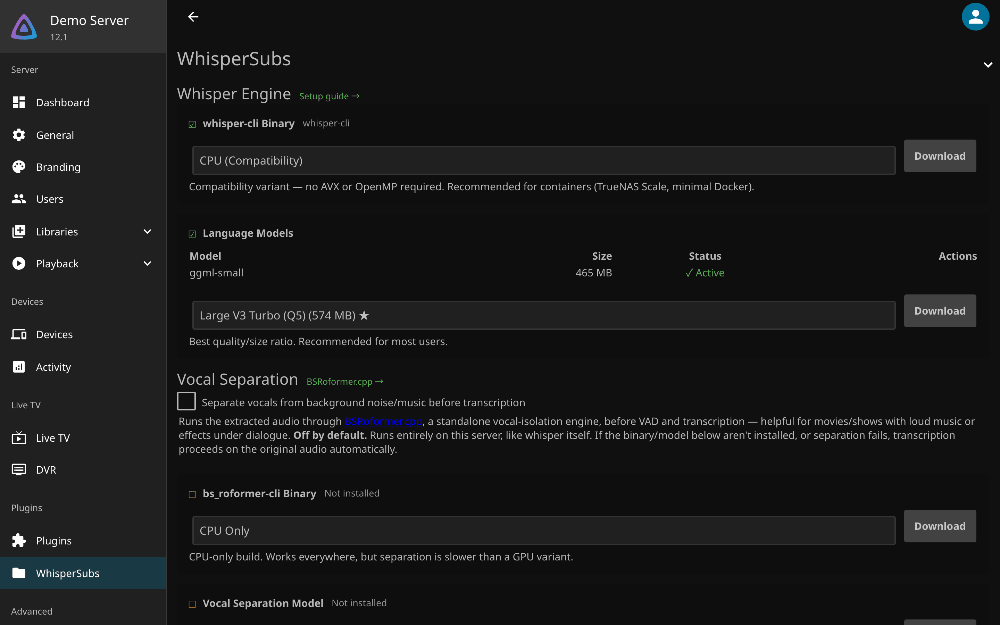
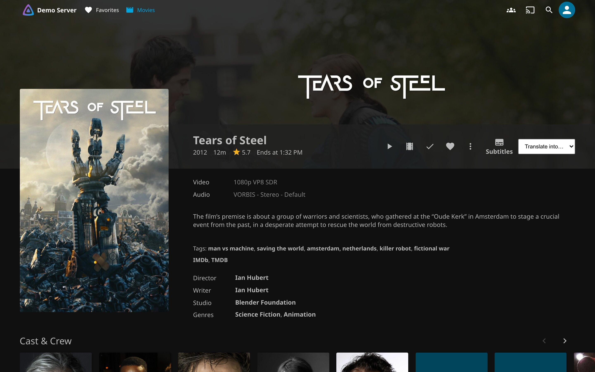
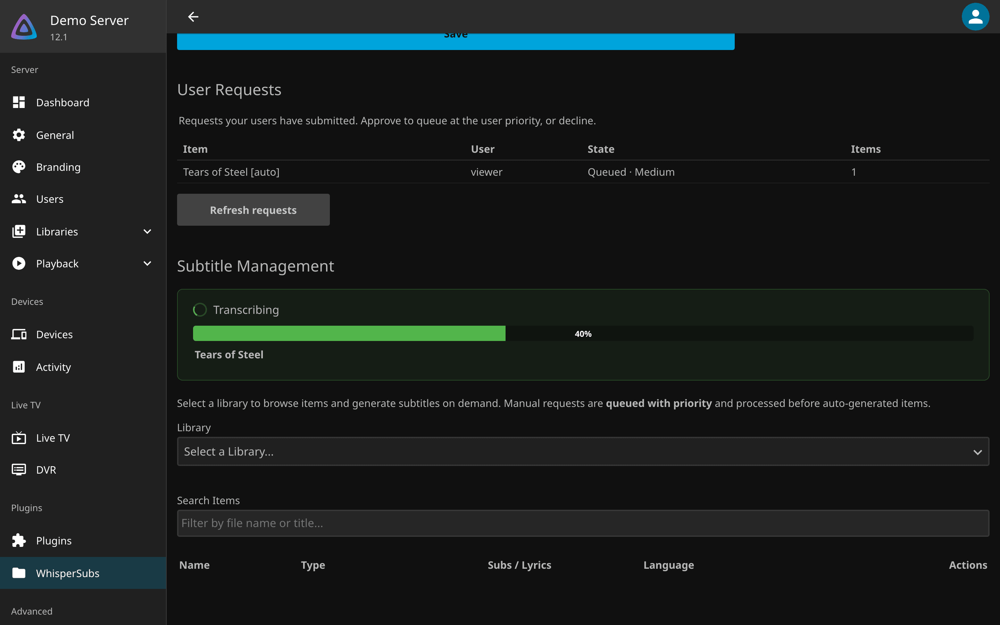
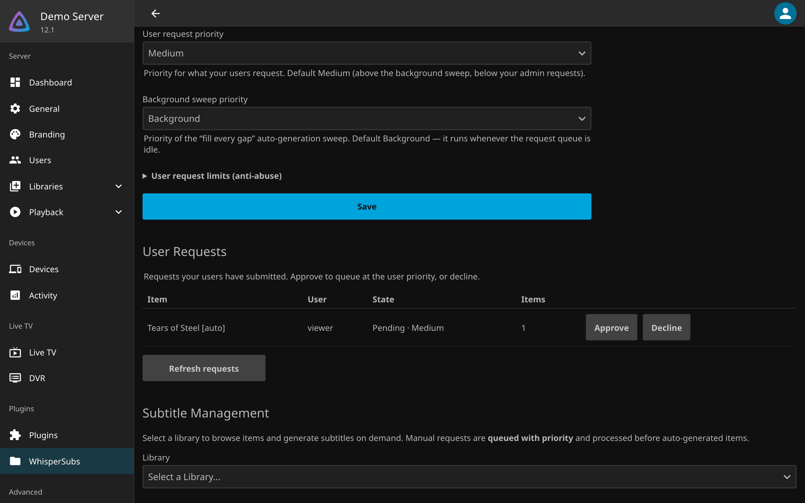
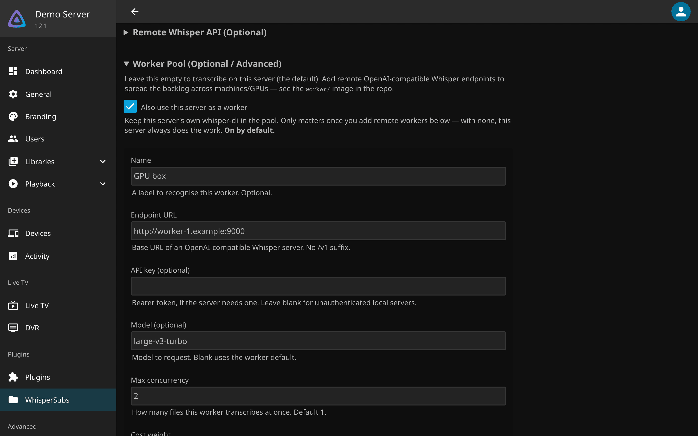
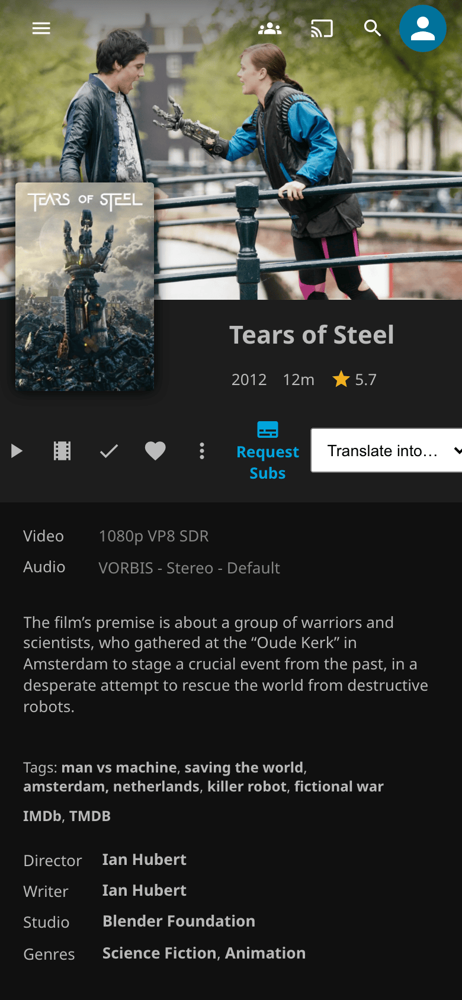

---
hide:
  - navigation
  - toc
---

# WhisperSubs { .ws-visually-hidden }

  

  
  
  
  
  

---

**WhisperSubs** is a Jellyfin plugin that writes subtitles for the titles in your library that have none, by transcribing their audio with local AI models. Download providers such as OpenSubtitles only serve what someone has uploaded, and Bazarr's Whisper path needs a second service running beside it; WhisperSubs runs inside Jellyfin and makes the subtitle from the audio, in the audio's own language, and can translate it into English or, from English audio, into 24 more languages. Transcription runs on hardware you control: this Jellyfin server by default, plus any [workers](remote-workers.md) you add. Start with the [Setup guide](docs/setup.md), then press **Generate Subtitles** on any title.

-   :material-download: **[Setup guide](docs/setup.md)**

    ---

    Add the plugin repository, install the plugin, then download the `whisper-cli` engine and a model from the settings page.

-   :material-chip: **[Choosing a variant](choosing-a-variant.md)**

    ---

    Which of the seven engine builds your CPU and GPU can run, and why exit code 132 means you picked the wrong one.

-   :material-tune: **[Settings reference](configuration.md)**

    ---

    Every setting on the page, what it changes and its default: languages, forced subtitles, file names, the sweep.

-   :material-stethoscope: **[Diagnostics](diagnostics.md)**

    ---

    The status and queue endpoints, the API key they need, and what a useful bug report contains.

## What it looks like

<figure markdown>

<figcaption>Engine and model, downloaded from the settings page</figcaption>
</figure>
<figure markdown>

<figcaption>The button and the Translate into list on every item page</figcaption>
</figure>
<figure markdown>

<figcaption>Live progress: the title, the phase, the queue</figcaption>
</figure>
<figure markdown>

<figcaption>A viewer's request, waiting for approval</figcaption>
</figure>
<figure markdown>

<figcaption>A remote worker in the pool</figcaption>
</figure>
<figure markdown class="ws-phone">

<figcaption>What a viewer sees on a phone</figcaption>
</figure>

## What it does

- A title with no subtitles gets one in the language of its audio, saved next to the file as `Movie.es.WhisperSubs.srt`, and the title is refreshed at once so the player offers the track right away.
- A film in a language you do not speak gets an English subtitle too; English audio can also get subtitles in 24 European languages (Canary, experimental). See [More target languages](configuration.md#more-target-languages-experimental).
- A film with a few lines of foreign dialogue gets a forced subtitle that covers only those lines.
- A title you ask for jumps ahead of the nightly sweep. Your users can ask too, and a request costs no CPU until you approve it.
- An interrupted job resumes from its last timestamp, and the daily sweep skips what it already checked.
- Music libraries can get `.lrc` lyrics (experimental), and vocal separation can clean noisy audio before transcription (optional). The full list is in [Features in detail](features.md).

## How it runs

- The plugin extracts the audio with Jellyfin's own ffmpeg, runs `whisper-cli` on it and writes the `.srt` next to the media file. [API and internals](api-and-internals.md) walks the pipeline step by step.
- On Linux the engine and a model download from the settings page; a GPU is used when there is one (CUDA, Vulkan or ROCm). On macOS and Windows you install `whisper-cli` yourself and set its path. TrueNAS, Proxmox LXC, Synology and unRAID have their own page: [Platform-specific installs](install-topologies.md).
- Transcription can spread across your own [workers](remote-workers.md) or a hosted endpoint, free workers first. This server can stay in the pool or step out of it.
- A scheduled task sweeps the library daily at 2:00 and on startup; **Generate Subtitles** and user requests go ahead of it.

## What it does not do

- It does not separate speakers, and it does not translate between two non-English languages.
- The recommended turbo models cannot translate; pick a medium or large non-turbo model for that.
- It never sends audio anywhere unless you add a remote worker or a hosted provider yourself.

[Limitations](limitations.md) has the reasons and the workarounds.

## Getting help

- Something broken: read [Diagnostics](diagnostics.md), then open an [issue](https://github.com/GeiserX/whisper-subs/issues) with what it asks for.
- A security problem: follow the [security policy](https://github.com/GeiserX/whisper-subs/blob/main/SECURITY.md), never a public issue.
- What is planned: the [roadmap on GitHub](https://github.com/GeiserX/whisper-subs/blob/main/ROADMAP.md). What changed: the [releases](https://github.com/GeiserX/whisper-subs/releases).
- The plugin catalog URL for Jellyfin is `https://geiserx.github.io/whisper-subs/manifest.json`.

## License

WhisperSubs is free software under the [GPL-3.0-or-later](https://github.com/GeiserX/whisper-subs/blob/main/LICENSE) license. It runs [whisper.cpp](https://github.com/ggerganov/whisper.cpp).
